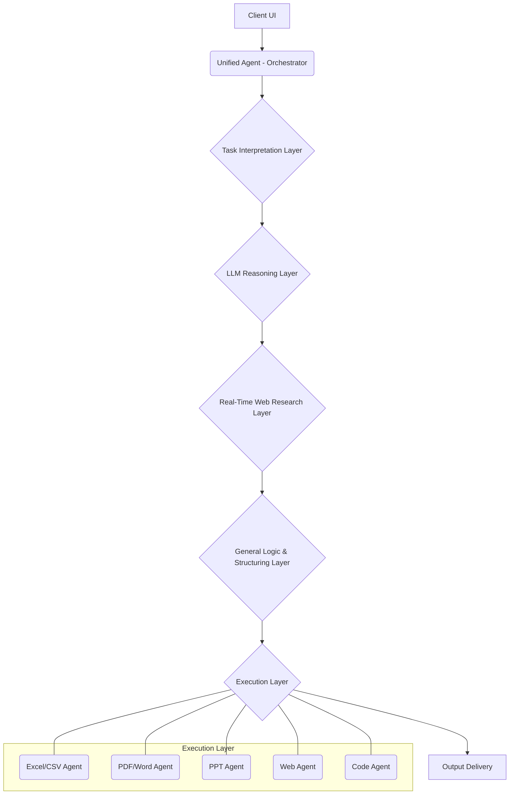

# McLeuker Agentic AI Platform: System Architecture

## 1. Introduction

This document outlines the system architecture for the McLeuker Agentic AI Platform. The platform is designed as an execution-first, agentic AI system that acts as a digital team member for professionals across various industries, with an initial focus on the fashion industry. The architecture is modular, scalable, and built to support complex workflows from a single user prompt to the delivery of finished, ready-to-use outputs.

## 2. High-Level Architecture Overview

The platform's architecture is centered around a **Unified Agent** that orchestrates a series of specialized layers to process user requests. This multi-layer approach ensures a clear separation of concerns, from understanding the user's intent to executing the final tasks.

The five core layers of the architecture are:

1.  **Task Interpretation Layer**
2.  **LLM (Reasoning) Layer**
3.  **Real-Time Web Research Layer**
4.  **General Logic & Structuring Layer**
5.  **Execution Layer**

Additionally, an **AI Search Platform** is integrated to provide advanced search capabilities.

### Architecture Diagram

## 3. The 5 Layers in Detail

### 3.1. Task Interpretation Layer

**Purpose:** To convert a raw user prompt into a structured, machine-readable task plan.

**Key Responsibilities:**

*   **Intent Detection:** Identify the user's primary goal.
*   **Domain Classification:** Detect the relevant industry or domain (e.g., fashion, tech, marketing).
*   **Output Format Detection:** Determine the required output formats (e.g., Excel, PDF, PPT).
*   **Research Assessment:** Decide if real-time web research is necessary and to what depth.
*   **Execution Plan Generation:** Propose an ordered sequence of tasks for the downstream layers.

**Implementation:** This layer will be implemented as a single, deterministic call to an LLM (e.g., GPT-4) with a specific function-calling schema (`interpret_task`). The output will be a JSON object that serves as the "contract" for the rest of the system.

### 3.2. LLM (Reasoning) Layer

**Purpose:** To think, plan, and structure the task, but not to execute it.

**Key Responsibilities:**

*   **Reasoning Plan:** Convert the interpreted task into a clear reasoning plan.
*   **Research Questions:** Define specific questions to be answered by the Web Research Layer.
*   **Data Structuring:** Define the required data structures for the final outputs.
*   **Logic Flow:** Outline the logical steps to transform raw data into finished deliverables.

**Implementation:** This layer will also be an LLM call, taking the output of the Task Interpretation Layer as input. It will use a `reason_task` function-calling schema to produce a "Reasoning Blueprint" in JSON format.

### 3.3. Real-Time Web Research Layer

**Purpose:** To gather up-to-date, domain-relevant information from the web.

**Key Responsibilities:**

*   **Web Crawling & Scraping:** Crawl and scrape authoritative sources based on the research questions from the LLM Layer.
*   **API Queries:** Query relevant APIs and databases for structured data.
*   **Information Synthesis:** Use an LLM to synthesize and structure the raw research findings.

**Implementation:** This layer will use tools like `Playwright` and `Requests` for web browsing and data extraction. It will be orchestrated by the Unified Agent based on the Reasoning Blueprint.

### 3.4. General Logic & Structuring Layer

**Purpose:** To transform the researched information into actionable, structured data ready for the final output generation.

**Key Responsibilities:**

*   **Data Transformation:** Organize raw data into tables, report outlines, presentation structures, etc.
*   **Workflow Sequencing:** Sequence the tasks for the Execution Layer.
*   **Industry-Specific Logic:** Apply domain-specific rules and frameworks (e.g., fashion trend analysis frameworks).

**Implementation:** This layer will involve a combination of LLM calls for data structuring and custom Python code for applying specific business logic.

### 3.5. Execution Layer

**Purpose:** To generate the final, ready-to-use deliverables in the requested formats.

**Key Responsibilities:**

*   **Dynamic Agent Selection:** The Unified Agent will dynamically select the appropriate output agent(s) based on the user's request.
*   **File Generation:** Generate files in various formats:
    *   **Excel/CSV:** For tables, product lists, and datasets.
    *   **PDF/Word:** For reports, market analyses, and briefs.
    *   **PPT:** For presentations.
    *   **Web:** For dashboards, content snippets, and HTML.
    *   **Code:** For scripts and automation pipelines.

**Implementation:** This layer will consist of a suite of specialized Python agents, each responsible for a specific output format. These agents will use libraries such as `pandas`, `openpyxl`, `reportlab`, `python-pptx`, and `FastAPI` (for web outputs).

## 4. AI Search Platform

The AI Search Platform will be a core capability integrated into the system, providing advanced search and information retrieval functionalities. It will be used by the Real-Time Web Research Layer to gather information.

**Key Features:**

*   **Multi-Source Search:** Search across a variety of sources, including general web, news, academic research, and APIs.
*   **Query Expansion:** Automatically expand user queries to improve search results.
*   **Source Prioritization:** Prioritize sources based on the domain and reliability.
*   **Content Summarization:** Summarize search results and extract key information.

## 5. Technology Stack

| Layer                       | Technology                                       | Rationale                                                     |
| --------------------------- | ------------------------------------------------ | ------------------------------------------------------------- |
| **Frontend (Web)**          | React / Next.js                                  | Fast iteration, dashboard-based UX, scalable UI               |
| **Backend Core**            | Python, FastAPI                                  | High-performance async backend, ideal for agent orchestration |
| **LLM Layer**               | OpenAI (GPT-4), Grok, Gemini                     | Best-in-class reasoning across all domains                    |
| **Agent Orchestration**     | LangGraph / Custom Orchestrator                  | Enables task planning, tool routing, and execution logic      |
| **Real-Time Research**      | Playwright, Requests, API connectors             | Web browsing, crawling, structured data extraction            |
| **Execution Layer**         | Python tool agents                               | Generate Excel, PDF, PPT, code, dashboards                  |
| **Data & Memory**           | PostgreSQL + pgvector                            | Task history, embeddings, semantic memory                     |
| **File Generation**         | pandas, reportlab, python-pptx, docx             | Task-ready deliverables                                       |
| **Cloud & DevOps**          | Supabase / AWS / GCP                             | Auth, storage, CI/CD, scalability                             |
| **Authentication**          | Supabase Auth / OAuth                            | Secure user management                                        |
| **CI/CD**                   | GitHub Actions                                   | Automated testing and deployment                              |

## 6. Next Steps

The next phase of the project will be to start building the individual layers, beginning with the Task Interpretation Layer. Each layer will be developed as a modular component that can be integrated into the overall system.
